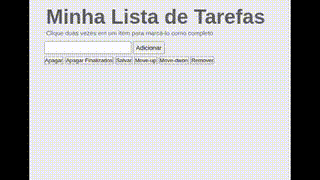

<body>
  <h1 align="center">Project Todo-list</h1>
  

    
  

  <h2 align="center">Descrição</h2>
  
Este projeto desenvolveu uma lista de tarefas utilizando HTML, CSS e JavaScript.

  <h2 align="center">Habilidades Desenvolvidas</h2>
  
No desenvolvimento deste projeto foi preciso utilizar o <b>HTML</b> para estruturação do conteúdo da página, o <b>CSS</b> para estilizá-la e o comportamento dinâmico da página foi adicionado com o <b>JavaScript</b>.

  <h2 align="center">📁 Acesso à aplicação</h2>
  

    
Você pode utilizar a aplicação clicando no link abaixo.

    <a href='https://jorge-case-pixels-art.netlify.app/'>Clique aqui para utilizar</a>
  

  <h4 align="center">Este projeto é um dos requisitos para a formação de Desenvolvimento Web da Trybe</h4>
  
O projeto finaliza a <b>Seção 4 - JavaScript, DOM, Eventos e Web Storage</b> do Módulo de Fundamentos e foi sugerido como um projeto bônus com <b>onze</b> requisitos obrigatórios e <b>três</b> requisitos optativos. Neste projeto obtive <b>100% de aprovação</b>.

    
Lista de requisitos obrigatórios:

  <ul>
    <li>Adicione à sua lista o título "Minha Lista de Tarefas" em uma tag.</li>
    <li>Adicione abaixo do título um pequeno e discreto parágrafo com id="funcionamento" e com o texto "Clique duas vezes em um item para marcá-lo como completo".</li>
    <li>Adicione um input com o id="texto-tarefa" onde a pessoa usuária poderá digitar o nome do item que deseja adicionar à lista.</li>
    <li>Adicione uma lista ordenada de tarefas com o id="lista-tarefas".</li>
    <li>Adicione um botão com id="criar-tarefa" e, ao clicar nesse botão, um novo item deverá ser criado ao final da lista e o texto do input deve ser limpo.</li>
    <li>Ordene os itens da lista de tarefas por ordem de criação.</li>
    <li>Clicar em um item da lista deve alterar a cor de fundo do item para cinza.</li>
    <li>Não deve ser possível selecionar mais de um elemento da lista ao mesmo tempo.</li>
    <li>Clicar duas vezes em um item, faz com que ele seja riscado, indicando que foi completo. Deve ser possível desfazer essa ação clicando novamente duas vezes no item.</li>
    <li>Adicione um botão com id="apaga-tudo" que quando clicado deve apagar todos os itens da lista.</li>
    <li>Adicione um botão com id="remover-finalizados" que quando clicado remove somente os elementos finalizados da sua lista.</li>
  </ul>
  
Lista de requisitos optativos:

  <ul>
    <li>Adicione um botão com id="salvar-tarefas" que salve o conteúdo da lista. Se você fechar e reabrir a página, a lista deve continuar no estado em que estava.</li>
    <li>Adicione dois botões, um com id="mover-cima" e outro com id="mover-baixo", que permitam mover o item selecionado para cima ou para baixo na lista de tarefas.</li>
    <li>Adicione um botão com id="remover-selecionado" que, quando clicado, remove o item selecionado.</li>
  </ul>

  

    <h4 align="center">Para mais informações sobre a formação de Desenvolvimento Web da Trybe, clique no link abaixo.</h4>
    <a href='https://www.betrybe.com/'>Curso de Desenvolvimento Web Trybe</a>
  

</body>
